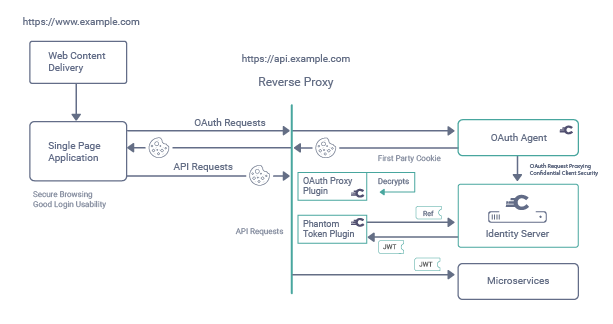

# OAuth Proxy NGINX Module

An NGINX module that decrypts secure cookies received from Single Page Applications.\
This is used to implement the OAuth Proxy component of the [Token Handler Pattern](https://curity.io/resources/learn/the-token-handler-pattern/).

## Security Behavior

The OAuth proxy is a forwarder to deal with cookie specific logic and does not perform the primary JWT verification.\
A typical flow for an SPA calling an API would work like this:

- The SPA makes an API call with an AES256 encrypted HTTP Only cookie containing an opaque access token
- The OAuth Proxy module decrypts the cookie to get the opaque access token
- The opaque access token is then forwarded in the HTTP Authorization Header
- The [Phantom Token Module](https://github.com/curityio/nginx_phantom_token_module) then swaps the opaque token for a JWT
- The HTTP Authorization Header is then updated with a JWT that is forwarded to the API
- The API must verify the JWT in the standard way on every request, to implement the primary JWT verification

### Cross Site Request Forgery

TODO

### API Routes

The same NGINX routes can be used for both web and mobile clients.\
This means the plugin can be easily bypassed, so it is essential that the API verifies received JWTs correctly.

| Client Type | Behavior |
| ----------- | -------- |
| Web | The cookie decryption and verification just described is used before forwarding the JWT |
| Mobile | If an HTTP Authorization header is found, the plugin assumes cookies are not used and simply returns |

## Example Usage

TODO

## Configuration Directives

TODO

## Implementation Details

To build the code yourself or to adapt it, see the 

## More Information

Please visit [curity.io](https://curity.io/) for more information about the Curity Identity Server.
